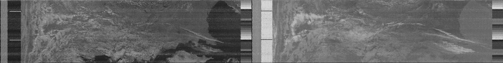
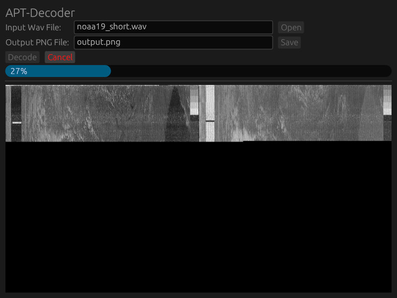
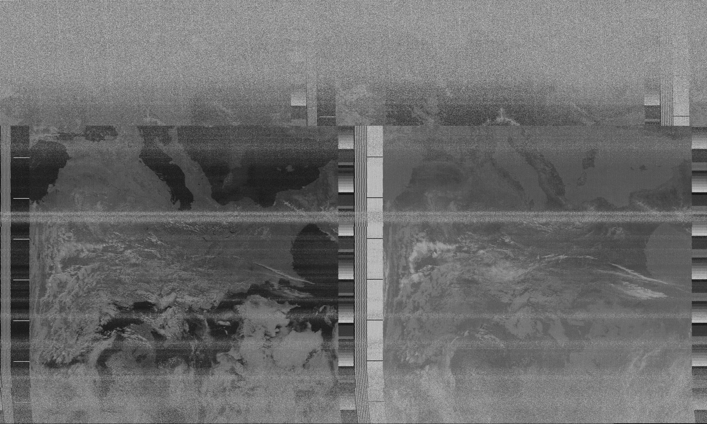

apt-decoder
===========
A simple tool for decoding the Automatic Picture Transmissions broadcasted
by the **NOAA Weather satellites** to PNG files.

Existing tools like WxToImg or atp-dect are either not open source or no longer maintained
and unnecessarily complex.
apt-decoder provides a lightweight, simple to use and easy to understand solution.

Releases
--------
You can download the latest release as a standalone binary,
for linux (appimage) and windows (just a statically linked exe file) under
https://gitea.zenerdio.de/sebastian/apt-decoder/releases

Building
--------
1. Install the development packages for `libgtk3` and `libxcb` for your distro.
  E.g. for anything Debian based:
  `sudo apt install libgtk-3-dev libxcb-shape0-dev libxcb-xfixes0-dev`
2. Install the rust compiler and cargo.
    E.g. using rustup (Try installing rustup using your package manager,
    don't use the stupid `curl | sh` stuff.)
3. Run `cargo build --release`
4. The `apt-decoder` binary is in `target/release`
5. Done

The default build will build a binary that contains,
both the GUI and the CLI version of the tool.
If you need something more lightweight (with no external dependencies),
it is also possible to build a pure-rust CLI-only version,
using `cargo build --release --no-default-features`.

Usage
-----
1. Save a received and FM-demodulated satellite signal as WAV-file.
    The WAV file has to be **mono**, **48kHz** and **32bit float**.
    When in doubt you can use audacity to convert your file into this format.
2. To run `apt-decoder` in GUI mode just execute the binary.
   For CLI mode use the `-n` flag:
   `apt-decoder -n <your WAV file> <destination PNG file>`
   For testing you can try the example contained in this repo:
   `apt-decoder -n noaa19_short.wav noaa19_short.png`
3. Look at the generated PNG file, adjust the dynamic and contrast with your favorite tool.
4. Done

Theory of Operation
-------------------

The AM-data from the WAV files is decoded using a simple square law demodulator.
Squaring the input signals yields the square of the original signal
and sideband with the twice the carrier frequency.

Computing the square root of the signal does not change its frequency spectrum,
but restores the amplitude of the original signal part.
The square root function is usually frowned upon in literature about signal processing,
as it is rather complex to implement on traditional DSP architectures.
In contrast to that ALUs in modern x86 or ARM CPUs can computer the square root efficiently,
so there is no harm in taking a shortcut here.

A lowpass then gets rid of the higher sideband, leaving only the demodulated original signal.

Afterwards the signal is sampled down to 4160kHz,
as original signal contains 4160 pixels per line.
For additional efficiency the upsampler inserts zeros into the input signal instead
of actually interpolating the missing samples.
This works because the downsampler following afterwards works by computing the average
over a number of samples and therefore acts as a low pass.

Finally a line syncer module looks for the **sync A** and **sync B** patterns to add
line sync information to the signal, which can then be written out into a PNG file.

Questions
---------
Feel free to write emails to sebastian(a)sebastians-site.de

Alternatively you can try [twitter](https://twitter.com/l_h_hacker), [mastodon](https://chaos.social/@sebastian) or *sebastian* on *hackint*.
